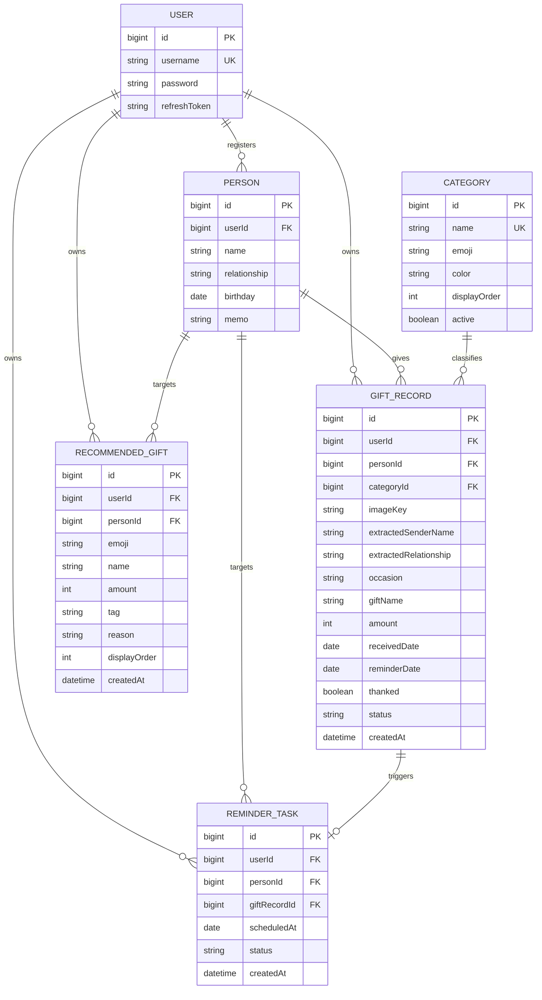

# 마음장부 — 백엔드 설계/구현 문서

받은 선물·부조금을 AI가 자동 정리하고 답례 시점을 알려주는 인간관계 관리 서비스 "마음장부"의 백엔드.
팀 구성: **AI**(모델 서빙), **인프라**(배포/클라우드), **풀스택**(프론트 중심), **나(백엔드)**.
`CLAUDE.md`의 프로젝트 컨벤션이 기본값이고, 이 문서는 도메인 특화 내용만 다룬다.

기술 스택: Spring Boot 4.0.6 / Java 25 / Gradle / H2(local) · MySQL(prod) / JPA `ddl-auto: update` /
Spring Security + JJWT / springdoc-openapi / AWS S3 SDK.

---

## 0. 이번 개편의 핵심 — 프론트 디자인 기준으로 도메인 재정의

프론트(`AI_Hackerton/src/main.jsx`)의 record 객체가 사실상 확정 명세이므로, 백엔드 모델을 여기에 맞췄다.

```js
{ id, person, relation, date, reminderDate, occasion, gift, category, price, emoji, color, thanked }
```

| 디자인 필드 | 백엔드 매핑 | 비고 |
|---|---|---|
| `person` / `relation` | `Person.name` / `Person.relationship` | 모달이 자유 입력이라 이름만 보내도 자동 등록 |
| `date` | `GiftRecord.receivedDate` | |
| `reminderDate` | `GiftRecord.reminderDate` + `ReminderTask.scheduledAt` | 아래 "결정 3" 참고 |
| `occasion` | `GiftRecord.occasion` (자유 텍스트) | 내 생일 / 프로젝트 축하 / 결혼식 … |
| `gift` | `GiftRecord.giftName` | |
| `category` | `Category` 엔티티 FK | 아래 "결정 1" 참고 |
| `price` | `GiftRecord.amount`(정수) + 응답의 `price`(포맷 문자열) | 아래 "결정 2" 참고 |
| `emoji` / `color` | `Category.emoji` / `Category.color`에서 파생 | 서버가 내려줌 |
| `thanked` | `GiftRecord.thanked` | 전용 토글 API 제공 |

**제거한 것**: `GiftType`(CASH/PRODUCT/…), `EventType`(BIRTHDAY/WEDDING/…) enum — 디자인 어디에서도 쓰이지 않고
`category` + `occasion`(자유 텍스트) 조합이 그 역할을 완전히 대체한다. `estimatedPriceMin/Max` 가격 범위도
모달의 금액 입력이 단일 값이라 `amount` 하나로 합쳤다. (CLAUDE.md의 "확실히 안 쓰면 완전히 삭제" 원칙)

---

## 1. 주요 결정사항과 근거

### 결정 1 — 카테고리는 enum이 아니라 **DB 테이블**

Java enum으로 고정하면 카테고리 하나 추가할 때마다 코드 수정 → 재컴파일 → 재배포가 필요해 해커톤 중 기획 변경이 병목이 된다.
그래서 `Category` 엔티티(`categories` 테이블)로 분리하고 `GiftRecord`가 FK로 참조한다.
`emoji`, `color`도 같은 테이블에 두어 이모지·색상 매핑이 코드에 흩어지지 않게 했다.

프론트는 `GET /api/categories`로 필터 칩(`'전체'`는 프론트가 앞에 붙임)과 모달 `<select>` 옵션을 그린다.
→ **카테고리를 추가해도 프론트 코드 수정이 필요 없다.**

#### 카테고리 추가하는 법 (둘 중 아무거나)

**(A) 관리 API 호출 — 권장, 재시작 불필요**

```bash
curl -X POST http://localhost:8080/api/categories \
  -H "Authorization: Bearer <accessToken>" \
  -H "Content-Type: application/json" \
  -d '{"name":"여행·체험","emoji":"✈️","color":"mint","displayOrder":80}'
```

`emoji`/`color`/`displayOrder`를 생략하면 각각 `🎁` / `blue` / 맨 뒤로 자동 채워진다.
수정은 `PATCH /api/categories/{id}` (이름·이모지·색·순서·`active`). `active:false`로 바꾸면 목록에서 숨겨지지만
이미 그 카테고리로 저장된 기록은 그대로 유지된다.

**(B) SQL 한 줄**

```sql
INSERT INTO categories (name, emoji, color, display_order, active)
VALUES ('여행·체험', '✈️', 'mint', 80, true);
```

`color`는 프론트 CSS 클래스명과 1:1이라 `mint` / `pink` / `blue` / `gold` 중에서 고르는 걸 권장한다(다른 값도 저장은 됨).

**초기 데이터**: 앱 기동 시 `config/CategoryInitializer`가 "이름이 없는 것만" 넣는다 —
디저트🍰(mint), 꽃·식물💐(pink), 부조금💌(blue), 패션·잡화👜(gold), 상품권🎫(mint), 생활용품🕯️(pink), 기타🎁(blue).
재기동해도 중복 삽입되지 않고, 나중에 이모지/색/순서를 바꿔놓아도 덮어쓰지 않는다.
**선물 기록 시드 데이터는 넣지 않는다** (디자인의 `starterRecords`는 프론트 목업용). 시드는 서비스가 돌아가려면
반드시 있어야 하는 마스터 데이터(카테고리)뿐이다.

**모르는 카테고리 이름 폴백**: AI가 우리가 모르는 카테고리 이름을 뱉거나 프론트가 오타를 보내도 저장이 실패하지 않고
`기타`로 떨어진다.

### 결정 2 — 금액은 **DB에 정수, 응답에 문자열 동시 제공**

- **저장**: `GiftRecord.amount` INTEGER (원 단위). 정렬(`sort=amount`), 금액 필터, 합계 집계를 하려면 정수여야 한다.
- **응답**: `amount`(35000)와 `price`("35,000원")를 **둘 다** 내려준다. 프론트는 `price`를 그대로 출력하면 되고
  가공이 필요할 때만 `amount`를 쓴다.
- **요청**: `price` 필드 하나로 받되 **숫자와 문자열을 모두 허용**한다. `35000`, `"35000"`, `"35,000원"` 전부 동작
  (서버가 숫자만 추출). 디자인의 금액 입력이 자유 텍스트라 프론트에서 별도 파싱을 하지 않아도 되게 한 조치다.
- 요청 필드는 문자열, 응답 필드는 정수+문자열로 타입이 비대칭이지만, 프론트 입장의 편의를 우선했다.

### 결정 3 — 답례 알림: `reminderDate` 컬럼 + `ReminderTask` 동기화

디자인 모달은 "답례 알림일"을 **절대 날짜**로 직접 입력받는다. 그래서 기존의 `anchorDate + offsetDays`
(생일 기준 D-7 계산) 구조는 제거했다.

- `GiftRecord.reminderDate` — 표시용 원본. 캘린더/타임라인/사람 상세가 조인 없이 바로 읽는다.
- `ReminderTask` — 발송 스케줄러가 쓰는 PENDING/SENT 상태 머신. 기록 1건 : 알림 1건으로 자동 upsert된다.
  (`reminderDate` 지정 → 생성, 변경 → reschedule + PENDING 복귀, 제거 → 삭제, 기록 삭제 → 동반 삭제)

의도적인 소규모 비정규화다. 캘린더·목록에서 조인을 줄이고, 스케줄러는 상태를 가진 별도 테이블에서 안전하게 배치 처리한다.

### 결정 4 — `color`/`emoji`는 서버가 결정

프론트가 매핑 테이블을 들고 있으면 카테고리 추가 시 프론트도 같이 고쳐야 한다. `Category` 테이블에 두고
응답의 `emoji`/`color`로 파생시켜 내려준다. 답례 알림(TO_GIVE) 이벤트는 항상 `🔔` / `coral`.

### 결정 5 — 사람은 이름으로 자동 등록

디자인에 사람 선택 UI가 없고 "보낸 사람"이 자유 입력 텍스트다. 그래서 기록 등록/수정 시
`personId`(있으면 우선) 또는 `personName`+`relation`을 받아, 같은 이름이 없으면 `Person`을 자동 생성한다.
`relation`을 같이 보내면 기존 사람의 관계 정보도 갱신된다.

### 결정 6 — 대시보드는 단일 종합 API

홈 화면은 통계 3종 + 에이전트 카드 + 최근 마음 + 추천 = 네 덩어리다. 프론트가 4번 호출하지 않도록
`GET /api/dashboard` 하나로 묶었다. 통계의 `"4개"`, `"이번 달 +3"`, `"가장 가까운 일정 27일 후"` 같은
표시 문자열까지 서버가 완성해서 내려준다.

### 결정 7 — 인프라 (변경 없음)

| 항목 | 결정 |
|---|---|
| DB | MySQL 확정 (prod). local은 H2 인메모리, `ddl-auto: update` |
| Java | 25 (`build.gradle` toolchain) |
| 이미지 업로드 | presigned URL — 클라이언트가 S3에 직접 PUT, 백엔드는 바이트를 안 받는다 |

---

## 2. 도메인 모델 (ERD)



| 엔티티 | 역할 | 비고 |
|---|---|---|
| `User` | 로그인 계정 | JWT 인증 대상, refresh token 저장 |
| `Person` | 마음을 주고받는 상대방 | 이름으로 자동 생성됨. `birthday`는 에이전트 카드에, `memo`는 추천에 쓰임 |
| `Category` | 선물 카테고리 마스터 | **코드가 아닌 DB row**. 추가 시 재배포 불필요 |
| `GiftRecord` | 받은 마음 1건 | `status`로 DRAFT(AI 추출 직후)/CONFIRMED(사용자 확정) 구분 |
| `ReminderTask` | 답례 알림 스케줄 | `GiftRecord.reminderDate`와 1:1 동기화. PENDING → SENT |
| `RecommendedGift` | AI 선물 추천 후보 | 대상별로 캐싱, `refresh=true`면 재생성 |

**enum**: `GiftRecordStatus`(DRAFT/CONFIRMED), `ReminderStatus`(PENDING/SENT),
`RecommendationTag`(취향 일치 / 실패 확률 낮음 / 답례 추천 — 디자인의 고정 3종이라 enum 유지, JSON에는 한글 라벨로 나감).

---

## 3. API 목록

모든 API는 `Authorization: Bearer <accessToken>` 필요 (`/health`, `/api/auth/**`, Swagger, H2 콘솔 제외).
모든 조회는 **현재 로그인 유저 소유로 스코핑**되며, 남의 데이터에 접근하면 404를 반환한다.
공통 응답은 `{success, data, error}` 상호배타 구조.

### 인증
| 메서드 | 경로 | 설명 |
|---|---|---|
| POST | `/api/auth/signup` | 회원가입 |
| POST | `/api/auth/login` | 로그인 → Access(12h)/Refresh(7d) 발급 |
| POST | `/api/auth/logout` | refresh token 무효화 |
| POST | `/api/auth/refresh` | 토큰 재발급 (DB 저장값과 대조) |

### 홈
| 메서드 | 경로 | 설명 |
|---|---|---|
| GET | `/api/dashboard` | 홈 화면 전체 — 통계 3종 + 에이전트 카드 + 최근 마음 + 추천 (`recentLimit`, `recommendationLimit`) |

### 카테고리
| 메서드 | 경로 | 설명 |
|---|---|---|
| GET | `/api/categories` | 필터 칩 / 모달 select용 목록 (`includeInactive`, 항목마다 `recordCount` 포함) |
| POST | `/api/categories` | 카테고리 추가 (재배포 불필요) |
| PATCH | `/api/categories/{id}` | 이름·이모지·색·순서·노출여부 수정 |

### 마음 기록
| 메서드 | 경로 | 설명 |
|---|---|---|
| GET | `/api/gift-records` | 목록 — 필터/검색/정렬/페이징 (아래 파라미터 표) |
| GET | `/api/gift-records/{id}` | 상세 |
| POST | `/api/gift-records` | 등록 (모달 저장 / 직접 등록) |
| POST | `/api/gift-records/extract` | 이미지 AI 분석 → DRAFT 생성 |
| PATCH | `/api/gift-records/{id}` | 부분 수정 + 확정(CONFIRMED) |
| PATCH | `/api/gift-records/{id}/thanked` | 감사 완료 여부 토글 |
| DELETE | `/api/gift-records/{id}` | 기록 + 연결된 답례 알림 삭제 |

목록 파라미터: `categoryId` / `category`(이름, `'전체'`면 미적용) / `personId` / `thanked` / `status` /
`startDate` / `endDate` / `q`(선물명·받은 이유·보낸 사람 이름 부분 일치) /
`sort`(`latest` 기본 · `oldest` · `amount` · `created`) / `page` / `size`(최대 100).
응답의 `totalElements`를 화면의 `"{N}개의 마음"`에 그대로 쓰면 된다.

### 사람
| 메서드 | 경로 | 설명 |
|---|---|---|
| GET | `/api/people` | 목록 (`q` 이름 검색). `giftCount` / `latestGift` / `latestReceivedDate` / `upcomingReminderDate` 포함 |
| GET | `/api/people/{id}` | 상세 — 요약 + 타임라인 한 번에 |
| GET | `/api/people/{id}/gift-records` | 타임라인만 (받은 날짜 최신순) |
| POST | `/api/people` | 등록 (같은 이름 있으면 갱신) |
| PATCH | `/api/people/{id}` | 부분 수정 |
| DELETE | `/api/people/{id}` | 남은 기록이 없을 때만 삭제 |

### 캘린더
| 메서드 | 경로 | 설명 |
|---|---|---|
| GET | `/api/calendar?year=&month=` | 월별. 생략 시 오늘 기준. 이벤트 있는 날짜만 포함 |
| GET | `/api/calendar/days/{date}` | 특정 날짜의 "이날의 마음" |

`days[].receivedCount`로 이모지 표시, `toGiveCount > 0`이면 답례 dot을 찍는다.
`events[].type`: `RECEIVED`(받은 마음, 카테고리 이모지) / `TO_GIVE`(답례 알림, `🔔`).
이벤트에 `person`/`gift`/`occasion`/`price`가 다 들어 있어 날짜 상세 패널도 추가 호출 없이 그릴 수 있다.

### 검색 / 추천 / 알림
| 메서드 | 경로 | 설명 |
|---|---|---|
| GET | `/api/search?q=&limit=` | 상단바 통합 검색 — `people` + `records` 동시 반환 |
| GET | `/api/recommendations?personId=&limit=&refresh=` | 선물 추천. `refresh=true`가 "다시 추천받기" |
| GET | `/api/reminders?includePast=&limit=` | 답례 알림 목록 (예정일 가까운 순, `daysLeft` 포함) |

### 이미지 / 헬스체크
| 메서드 | 경로 | 설명 |
|---|---|---|
| POST | `/api/gift-assets/presigned-url` | S3 업로드용 presigned PUT URL 발급 |
| GET | `/health` | 서버 생존 확인 (인증 불필요) |

Swagger UI: `/swagger-ui.html`, OpenAPI JSON: `/v3/api-docs`. 모든 엔드포인트/DTO 필드에 한글 설명이 붙어 있다.

---

## 4. AI 팀 인터페이스 (그대로 전달 가능)

백엔드 → AI 서비스는 HTTP(REST) 호출. base URL은 env var `AI_SERVICE_URL`,
인증은 `X-API-KEY` 헤더(`AI_SERVICE_API_KEY`), 타임아웃 `AI_SERVICE_TIMEOUT_MS`(기본 30초).

**`AI_SERVICE_URL`이 비어 있거나 호출이 실패하면 백엔드가 하드코딩 더미 결과로 자동 폴백**한다.
덕분에 AI 서비스가 아직 없어도 프론트는 전체 흐름을 지금 바로 개발/테스트할 수 있고,
나중에 env var만 채우면 실제 AI 서비스로 자동 전환된다.

### 4-1. 이미지 분석 `POST {AI_SERVICE_URL}/extract`

**요청 바디는 `imageUrl` 하나로 확정.** S3 key나 raw bytes는 보내지 않는다.

```json
{ "imageUrl": "https://<bucket>.s3.<region>.amazonaws.com/gift-images/... (presigned GET URL)" }
```

흐름: 사진 촬영 → 백엔드가 presigned PUT URL 발급 → **클라이언트가 S3에 직접 업로드** →
클라이언트가 백엔드에 `imageKey` 전달 → **백엔드가 조회용 presigned GET URL을 만들어 `imageUrl`로 전송** →
AI 서비스가 그 URL로 이미지를 직접 내려받아 분석 → 응답을 백엔드가 DB에 DRAFT로 저장.

presigned GET URL 만료는 **900초(15분)** — AI 분석 시간보다 충분히 길게 잡았다. 더 필요하면
`S3PresignService.GET_URL_DURATION`을 늘리면 된다.

**응답 스키마 (고정)**

```json
{
  "senderName":   "김민수",
  "relationship": "친한 친구",
  "receivedDate": "2026-08-18",
  "occasion":     "내 생일",
  "giftName":     "스타벅스 케이크",
  "category":     "디저트",
  "amount":       35000,
  "confidence":   0.82
}
```

- `category`는 서버 `categories` 테이블의 이름과 매칭된다 (모르는 값이면 `기타`로 폴백).
  현재 값: 디저트 / 꽃·식물 / 부조금 / 패션·잡화 / 상품권 / 생활용품 / 기타 (+ 나중에 추가되는 것).
- `amount`는 정수(원). 범위가 아니라 단일 추정치.
- **값을 모르면 임의로 지어내지 말고 `null`로 보낼 것** — 사용자가 확인 폼에서 직접 채운다.
- `confidence`는 현재 저장하지 않지만 스키마에는 유지 (나중에 "확신 낮음" 배지에 쓸 여지).

### 4-2. 선물 추천 `POST {AI_SERVICE_URL}/recommendations`

**요청**
```json
{
  "personName": "김민수",
  "relationship": "친한 친구",
  "memo": "커피를 좋아함",
  "limit": 3,
  "recentGifts": [
    { "giftName": "스타벅스 케이크", "category": "디저트", "amount": 35000,
      "occasion": "내 생일", "receivedDate": "2026-08-18" }
  ]
}
```

**응답**
```json
{
  "items": [
    { "emoji": "☕", "name": "스페셜티 드립백 세트", "amount": 32000,
      "tag": "취향 일치", "reason": "민수님이 커피를 좋아하고, 받은 선물과 부담이 비슷해요." }
  ]
}
```

`tag`는 `"취향 일치"` / `"실패 확률 낮음"` / `"답례 추천"` 셋 중 하나 (다른 값이면 "실패 확률 낮음"으로 처리).

### 4-3. 요청사항
- AI 서비스에도 `/health` 엔드포인트를 붙여줄 것 (데모 전 전체 시스템 점검용)
- AI 서비스가 S3 presigned URL로 이미지를 받아가므로 별도 S3 권한은 필요 없다 (URL 자체에 서명이 포함됨)

---

## 5. 인프라 팀 인터페이스

- **전달할 것**: 멀티스테이지 `Dockerfile`, 단일 서비스 `docker-compose.yml`, `/health` 엔드포인트
- **필요 리소스**: EC2(백엔드), RDS(MySQL), S3(이미지), ECR, AI 서비스용 인스턴스(GPU 여부는 AI 팀 확인 필요)
- **env var 목록**
  ```
  SPRING_PROFILES_ACTIVE=prod
  DB_HOST, DB_PORT, DB_NAME, DB_USERNAME, DB_PASSWORD
  S3_BUCKET, AWS_REGION   (IAM Role 쓰면 AWS_ACCESS_KEY_ID/SECRET 불필요)
  AI_SERVICE_URL, AI_SERVICE_API_KEY, AI_SERVICE_TIMEOUT_MS
  JWT_SECRET
  ```
- 배포 파이프라인 경계: GitHub Actions로 ECR push까지 백엔드/CI, 그 이후 EC2 pull·재기동은 인프라

---

## 6. 프론트 인수인계 요약

1. **인증**: 모든 API에 `Authorization: Bearer <accessToken>`. 미인증은 401 + 공통 에러 포맷.
2. **금액**: 표시용은 `price`("35,000원"), 계산용은 `amount`(35000). 보낼 때는 `price`에 숫자든 문자열이든 넣으면 된다.
3. **카테고리·이모지·색상**: 하드코딩 금지. `GET /api/categories`로 받아서 그린다. 기록 응답의 `emoji`/`color`도 서버 제공.
4. **사람**: 미리 등록 안 해도 된다. 기록 저장 시 `personName`+`relation`만 보내면 자동 생성/갱신된다.
5. **이미지**: presigned PUT URL로 **클라이언트가 S3에 직접 업로드**한 뒤 `imageKey`를 `/extract`에 전달.
   조회 시 `imageUrl`(presigned GET, 15분 만료)은 매 응답마다 새로 발급되므로 캐싱하지 말 것.
6. **AI 미연동 상태**: `/extract`와 `/recommendations`는 지금 더미 값을 반환한다. 스키마는 실제와 동일하므로
   화면을 그대로 만들면 나중에 코드 변경 없이 실제 결과로 바뀐다.

---

## 7. 알림 스케줄러

`ReminderDispatchScheduler` — `@Scheduled(cron = "0 */10 * * * *")`, 10분 주기.
`status=PENDING` 이면서 `scheduledAt <= 오늘`인 건을 200건씩 페이지 단위로 가져와 SENT로 전환한다.
`(status, scheduledAt)` 복합 인덱스가 걸려 있고, 자정에 몰아 처리하지 않고 시간대로 분산한다.

실제 푸시/메일 발송은 미구현 — 현재는 상태 전환 + 로그까지다. 외부 발송을 붙일 때는 트랜잭션 밖 비동기로 분리할 것.

---

## 8. 성능/안전 고려사항 (구현됨)

- **N+1 방지**: 목록/캘린더/사람 상세 조회는 `@EntityGraph`로 `person`, `category`(알림은 `giftRecord.category`까지) fetch join.
  사람 목록의 마음 개수·카테고리별 개수는 `GROUP BY` 집계 쿼리 한 방으로 처리한다.
- **소유권 스코핑**: 모든 조회/수정이 `user.username` 조건을 포함한다. 남의 리소스는 404.
- **인덱스**: `gift_records(user_id, receivedDate)`, `gift_records(user_id, createdAt)`,
  `reminder_tasks(status, scheduledAt)`, `recommended_gifts(user_id, person_id)`.
- **페이징 상한**: 목록 `size` 최대 100, 검색 `limit` 최대 50, 추천 최대 10.

---

## 9. 미구현 / 남은 것

- 알림 **실제 발송**(푸시/메일/카카오) — 현재는 PENDING → SENT 상태 전환만
- Google Calendar 연동 및 ICS 폴백
- 원본 이미지 PII 마스킹 및 `DELETE /api/gift-records/{id}/image`
- AI 분석 진행 상황 SSE 스트리밍 (현재는 동기 호출, 더미라 즉시 응답)
- AI 응답 Redis 캐싱 (추천은 DB에 저장해 재사용 중이라 당장 필요는 없음)
- 카테고리 삭제 API (기록이 참조 중이면 위험해서 `active=false` 비활성화로 대체)
- `confidence` 저장 및 "확신 낮음" 표시
